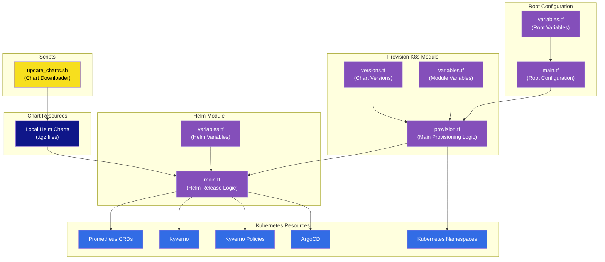

# Infrastructure Architecture

This document describes the architecture of the Kubernetes infrastructure provisioning system.

## Overview

The infrastructure is managed using Terraform and consists of modules for provisioning Kubernetes resources using Helm charts. The system supports different environments (basic, staging, production) with environment-specific configurations.

## Architecture Diagram

## Component Description

### Root Configuration
- **main.tf**: Defines the Terraform providers (Kubernetes, Helm, Null, Talos) and calls the provision_k8s module
- **variables.tf**: Defines input variables for the root module, including environment type and kubeconfig path

### Provision K8s Module
- **provision.tf**: Main logic for provisioning Kubernetes resources, including namespaces and Helm releases
- **versions.tf**: Defines chart versions for different environments
- **variables.tf**: Defines input variables for the provision_k8s module

### Helm Module
- **main.tf**: Implements the Helm release resource with proper lifecycle management
- **variables.tf**: Defines input variables for the Helm module

### Kubernetes Resources
- **Namespaces**: Created for each deployment with proper labels and annotations
- **Prometheus CRDs**: Custom Resource Definitions for Prometheus monitoring
- **Kyverno**: Policy management engine for Kubernetes
- **Kyverno Policies**: Policies for Kyverno
- **ArgoCD**: GitOps continuous delivery tool for Kubernetes

### Scripts
- **update_charts.sh**: Downloads Helm charts from repositories and saves them locally

### Chart Resources
- Local Helm chart files (.tgz) stored in the resources directory
